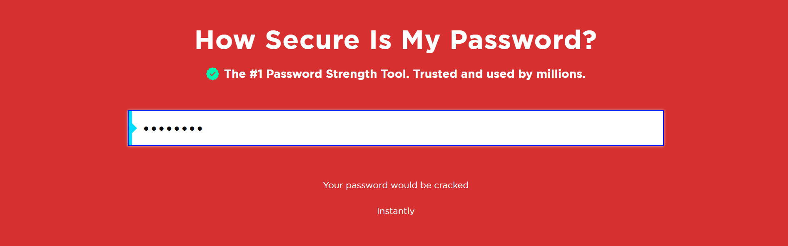
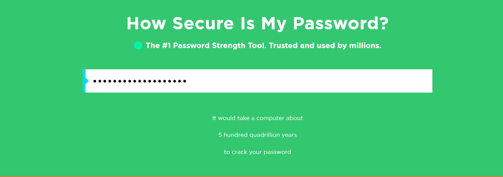

# CyberSecurity_Internship-Elevate_labs-task6
## Overview

This project demonstrates how to create, evaluate, and manage strong passwords.

---

##  Objective

- Learn what makes a password strong.
- Test password strength using online tools.
- Summarize best practices for password creation & management.

---

## Password Samples & Strength Evaluation

Tested using [Security.org How Secure is My Password] [PasswordMeter](https://www.passwordmeter.com/):

| Password Example         | Description                         | Strength      | Estimated Crack Time   | Feedback                                   |
|-------------------------|-------------------------------------|---------------|-----------------------|---------------------------------------------|
| 12345678                | Numbers                             | Very Weak   | Instantly             | Common, easily guessed, in breach databases |
| password123             | lowercase + numbers                 |  Weak       | Few seconds           | Predictable pattern, common substitution    |
| Password20              | Mixedcase + numbers                 |  weak       | 1 days                | Substitution known, not unique enough       |
| amG@gtr369              | Secure format, all character types  |  Strong     | 5 Years               | Good mix, unique, not a dictionary word    |
|Passwor@MaxSec385      | Complex, long, all character types    |  Excellent  |  quadrillion years    | Long, complex, unique, all character types  |

## Weak password Vs Strong password
  VS 

## Best Practices for Secured Passwords

- **Length:** Use at least 12–16 characters; longer is better! 
- **Complexity:** Mix uppercase, lowercase, numbers, and symbols.
- **Unpredictability:** Avoid dictionary words, names, or common phrases.
- **Uniqueness:** Never reuse passwords across websites. 
- **Password Managers:** Use tools like **Bitwarden** or **KeePass** to generate and store strong, unique passwords.
- **Avoid Browser Autofill:** Not recommended for sensitive accounts; password managers are safer. 
- **Categorize Passwords:**
  - **Mail & Finance:** Use the strongest passwords, change every 120 days.
  - **Temporary Sites:** Use less critical passwords, but never reuse important ones.
- **Update Regularly:** Change passwords for sensitive accounts every few months.

## Common Password Attacks & Defenses

| Attack Type         | Description                                   | Defense                                      |
|---------------------|-----------------------------------------------|----------------------------------------------|
| Brute Force         | Tries all possible combinations               | Long, complex passwords                      |
| Dictionary Attack   | Uses common words/phrases                     | Avoid dictionary words & common substitutions|
| Credential Stuffing | Uses leaked password pairs                    | Unique passwords for every account           |
| Password Spraying   | Tries common passwords across many accounts   | Avoid common passwords                       |
| Keylogger           | Captures keystrokes                           | Use security software, avoid suspicious links|
| Rainbow Table       | Precomputed hash tables                       | Use strong, salted hashes (for admins)       |

---
